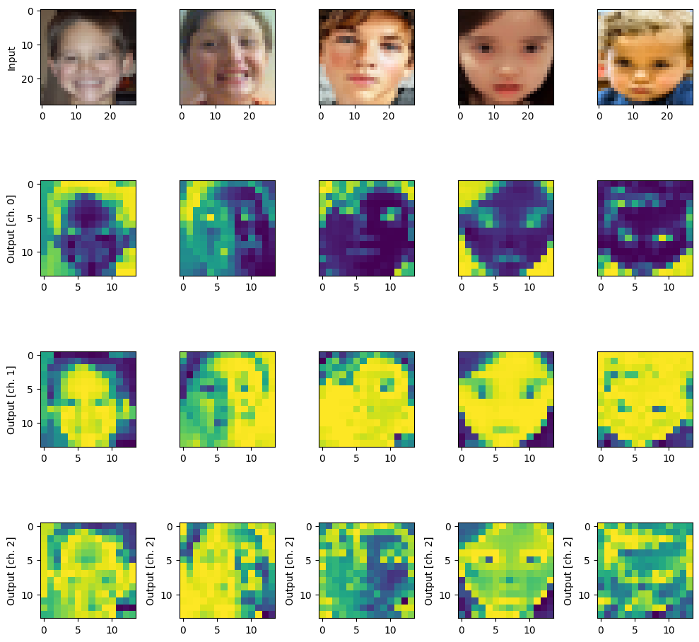
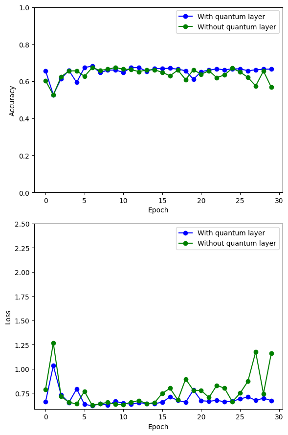

# Automated Medical Image Diagnostics using QML

dataset can be found [here](https://drive.google.com/drive/folders/1kFSl8acOOQLJwG3v9Sdx2Q-TKpkA_U8b?usp=drive_link):

This project integrates quantum processing into a classical deep learning pipeline, demonstrating the potential of quantum convolution in image classification tasks. The readme file could further discuss the implications of combining quantum and classical approaches and interpret the training results.

## Libraries

1. **PennyLane (`pennylane`):**
   - **Purpose:** PennyLane is a library for differentiable programming of quantum computers. It allows users to define quantum circuits and seamlessly integrate them with classical machine learning frameworks like TensorFlow.

2. **NumPy (`np`):**
   - **Purpose:** NumPy is a powerful library for numerical operations in Python. It is extensively used for mathematical and array operations.

3. **PennyLane Templates (`pennylane.templates`):**
   - **Purpose:** This module provides pre-defined quantum circuit templates. In this code, `RandomLayers` is used to implement a random quantum circuit.

4. **TensorFlow (`tf`):**
   - **Purpose:** TensorFlow is an open-source machine learning library. In this code, it's used for building, training, and evaluating classical deep learning models.

5. **Keras (`keras`):**
   - **Purpose:** Keras is a high-level neural networks API running on top of TensorFlow. It provides an easy-to-use interface for building and training neural networks.

6. **Matplotlib (`plt`):**
   - **Purpose:** Matplotlib is a 2D plotting library for creating visualizations. In this code, it's used for plotting accuracy and loss curves.

7. **OS (`os`):**
   - **Purpose:** The `os` module provides a way to interact with the operating system. It's used here to handle file paths and check if directories exist.

8. **PIL (`Image` from `PIL`):**
   - **Purpose:** The Python Imaging Library (PIL) is used for opening, manipulating, and saving image files. In this code, it's used to load and preprocess images.

9. **Scikit-learn (`train_test_split`):**
   - **Purpose:** Scikit-learn is a machine learning library. The `train_test_split` function is used to split the dataset into training and testing sets.

## Procedure

1. **Initialization and Configuration:**
   - The code starts by importing necessary libraries, including PennyLane for quantum computing, TensorFlow for classical deep learning, and Matplotlib for visualization.
   - Parameters such as the number of optimization epochs (`n_epochs`), the number of random layers in the quantum circuit (`n_layers`), and dataset sizes are set.

2. **Dataset Loading and Preprocessing:**
   - Images and labels are collected from the "consolidated" dataset folder, where images are categorized into "Autistic" and "Non_Autistic" subfolders.
   - Labels are encoded with indices for autistic and non-autistic classes.
   - Image preprocessing involves resizing, normalization, and adding an extra dimension for convolution channels. The dataset is then split into training and testing sets using `train_test_split` from scikit-learn.
  

3. **Quantum Circuit Definition (`circuit`):**
   - A quantum device with 4 qubits is created using PennyLane.
   - The quantum circuit `circuit` is defined as a QNode (quantum node) using PennyLane's automatic differentiation interface. It consists of encoding classical input values, applying random quantum layers, and measuring classical output values.

4. **Quantum Convolution (`quanv`):**
   - The function `quanv` convolves the input image with multiple applications of the same quantum circuit. It processes squared 2x2 regions of the image using the quantum circuit, producing a quantum-processed image with multiple channels.

5. **Quantum Pre-processing of Images:**
   - Training and test images are quantum pre-processed using the `quanv` function. The quantum circuit is applied to 2x2 regions of each image, and the results are stored in `q_train_images` and `q_test_images`.

6. **Saving Pre-processed Images:**
   - The quantum pre-processed images are saved in a specified directory.

7. **Visualization:**
   - A visualization is created to show original and quantum-processed images side by side. The first row displays original images, and subsequent rows display the output channels of the quantum-processed images.

8. **Neural Network Model Definition (`MyModel`):**
   - A simple Keras model (`MyModel`) is defined with a flatten layer and a dense layer with softmax activation. Two models are created: `q_model` for quantum-processed images and `c_model` for classical images.

9. **Model Training:**
   - Both models are trained using the pre-processed quantum images (`q_model`) and original images (`c_model`).
   - Training history is recorded for later visualization.

10. **Accuracy and Loss Visualization:**
    - Matplotlib is used to visualize the accuracy and loss of the quantum model and classical model over epochs. The results are shown in two subplots, one for accuracy and one for loss, comparing the performance with and without the quantum layer.

 

## Code Repo

Access the code in the [notebook](penn.ipynb)
