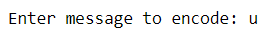
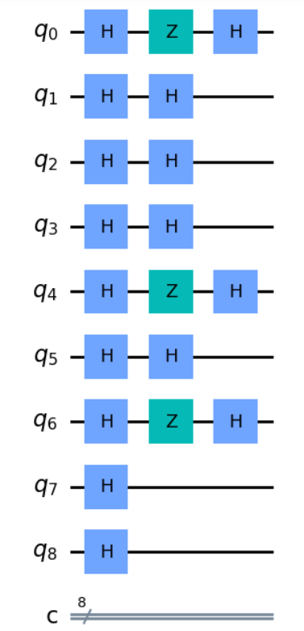
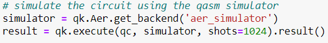
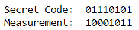
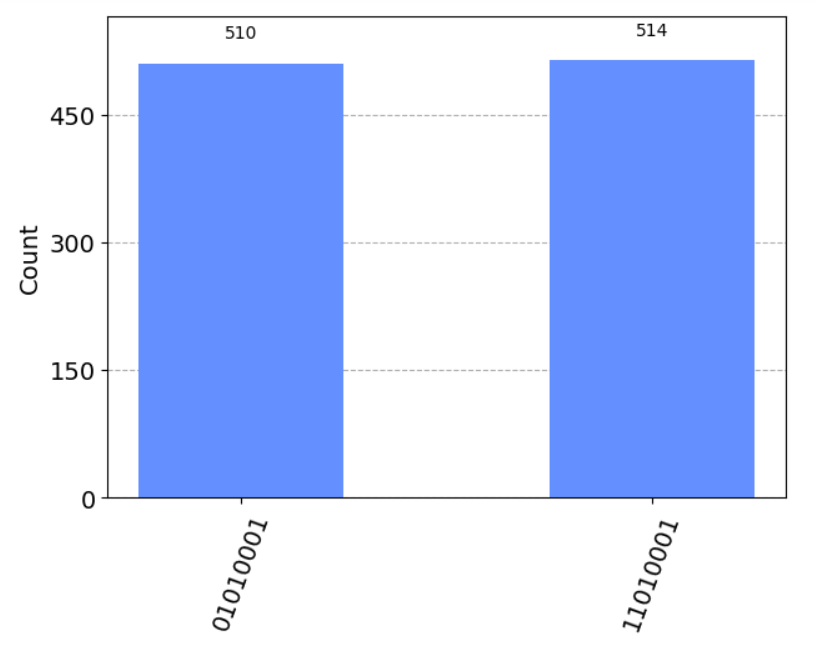

## Abstract
Nowadays we all use **QR code** for multiple purposes like making payments, sharing WiFi, etc. Have you ever wished to generate such QR code on your own ?, this project is for generating a QR code using `Qiskit` Sdk and `Python` programming language. 

More detailed explaination can be found [here:](https://shisheerkaushik.netlify.app/)

## Project Contribution
This project work was submitted to the [QC-Hack 2021](https://www.quantumcoalition.io/qc-hack-2021) organized by [QuantumCoalition](https://www.quantumcoalition.io/). During the hackathon, I had the opportunity to learn and implement ideas in the field of Quantum Algorithms. It was a pleasure to be part of this hackathon. Thanks to [IBM Quantum](https://www.ibm.com/quantum) & [Google Quantum AI](https://quantumai.google/), I received credits to execute our code on real quantum hardware.

## General Implementation 
Sure, here's a step-by-step explanation of the code along with the packages used and their purpose:

1. The first package is `qrcode`, which is a Python library that generates QR codes. It allows you to create QR codes for a wide range of use cases, such as encoding URLs, text messages, phone numbers, and more.

3. The third package used is `plot_histogram` from `qiskit.visualization`, which is a module in the qiskit library that provides tools for visualizing quantum circuits and their results.

4. The first line of the code imports the qiskit library, which is needed to define quantum registers and circuits, and to execute them on various backends.

5. The second line of the code imports qiskit again but gives it an alias of `qk`, which is a common shorthand used by many developers.

6. The third line of the code imports qrcode, which is used to generate a QR code for the encoded message.

7. The fourth line of the code imports the `plot_histogram` function from `qiskit.visualization`, which is used to plot the histogram of the measurement outcomes.

8. The next line of code prompts the user to enter a message to encode and stores it in the variable message.

  

9. The next line of code removes duplicate characters from the message by converting it to a set, sorting it, and then joining it back together as a string. This is done to ensure that the message is unique and has a consistent order.

10. The next line of code converts the message to binary by using the format function to convert each character to its 8-bit `ASCII` code and then concatenating the results.

11. The next block of code initializes the quantum circuit by creating a quantum register q with a size equal to the length of the binary message plus one, and a classical register c with a size equal to the length of the binary message. It then creates a quantum circuit qc with these registers.

12. The next line of code applies a Hadamard gate `H gate` to all the qubits in the quantum circuit `qc`. This creates a *superposition* of all possible states for the qubits.

  

13. The next block of code defines the oracle as a secret binary string, which is used to mark the state that we want to find. In this case, the secret binary string is the complement of the binary message, where each 0 is replaced with **1** and each 1 is replaced with **0**.

14. The next block of code applies a `Z gate` to each qubit in the quantum circuit `qc` that corresponds to a **1** in the oracle. This flips the phase of the state `|x>` for each marked element, where `|x>` is the binary representation of the element.

  

15. The final step is to apply the Hadamard gate to each qubit in the quantum circuit. This puts the qubits in a **superposition** of all possible states, which will allow us to measure all possible outcomes with equal probability.

  

16. We add a measurement gate to each qubit in the quantum circuit. This collapses the superposition of states into a single classical bit.

17. Finally, we run the quantum circuit on a quantum simulator using the `Aer` package from Qiskit.

  

The Aer package provides a range of simulators for running quantum circuits. In this case, we use the `qasm_simulator` backend, which simulates the behavior of a real quantum computer and returns the outcomes of the measurements in the form of a dictionary containing the counts of each possible result.

The execute function takes the quantum circuit qc and the backend as inputs, and runs the circuit on the backend to obtain the results. The shots parameter specifies the number of times the circuit should be run to obtain statistics on the outcomes.

The result variable contains the result of the simulation, which includes the counts of each possible outcome. The counts variable is then used to print the result of the algorithm, which is the binary representation of the marked element.

The generated QR-code :

  

Verified the obtained *QR-code* with the Google_lens:

  

