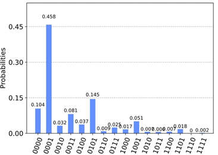

# Quantum_BB84_Encryption

The idea is to encode the sender's text`(secret message)` using the concept of interference. The secret message is encoded based on the cover file`(a text sentence in this case)`. A Demo video of interactive working implementation is available here: [Demo](https://drive.google.com/file/d/1RHY_QOV1cPRRPEe5KYRz-5Mahdmc7Ia7/view?usp=sharing). 

We have chosen our cover file and the secret message to be in text formats to make it easier for new learners to understand the concept of quantum steganography while also trying it out interactively in a console. 

## Project Idea

We have implemented Quantum Steganography using qiskit in this project.   

We have chosen our cover file and the secret message to be in text formats to make it easier for new learners to understand the concept of quantum steganography while also trying it out interactively in a console. 

## Implementation Details

The encoder circuit is based on 7 qubits but our interactive application has an option to create circuits based on the number of qubits selected and view them instantaneously.  

Here are some steps to interactively play with our application:

1. Choose the number of qubits using the slider. We would suggest that you choose 7 for the encoding and decoding scheme to work flawlessly. You can also test out other number of qubits to view the generated circuit.  

2. Enter the Secret message and press enter. For instance, let us try a letter, NOTE: Enter only small letters [i.e f,h,l, etc ]

Here, you can also view the generated circuit.

Above is the transpilated circuit generated with respect to the secret key entered, using the special gates during Quantum Simulation  

3. This graph shows the output generated with respect the secret key entered

4. Upload a sentence where you wish to hide your message and press enter. NOTE: Enter only small words [i.e family,hindrance,lanquage, etc ]

5. Click on encode to view the encoded message

6. Then click on decode to finally view your original secret message

All the simulation was done qiskit sdk: [Secret key used: Qiskit]

a] Simulator

The fig(a) graph selected is the output generated from the Quantum Simulator [ qasm_simulator]

b] Quantum Cumpter [ibmq-melbourne]

The fig(b) graph slected is the output generated from the Real Quantum Computer [ ibmq-melbourne]

In order to explain concisely, I have used secret key to be as: 

# qiskit. 

The evaluation was done using two different backend computers in order to obtain more precise and accurate results and compare the relative results obtained with every backbend’s utilized. As it is seen in the graphs, the simulation done on real quantum computer is comparatively different from the one done on simulation. It’s because Quantum computers are exceedingly difficult to engineer, build and program. As a result, they are crippled by errors in the form of noise, faults and loss of quantum coherence, which is crucial to their operation and yet falls apart before any nontrivial program has a chance to run to completion. 

1] On Simualtor [qasm]

2] On real Quantum Computer [ibmq-bogota]:

3] on real Quantum computer [ibmq-bogota] {Hybrid Model}:

Contributor:

- [Shisheer S Kaushik](https://www.linkedin.com/in/shisheerkaushik24/)

