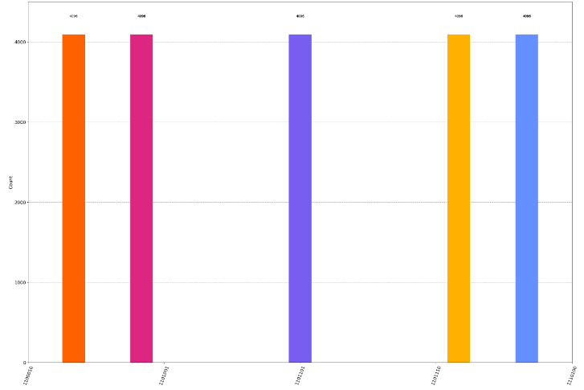
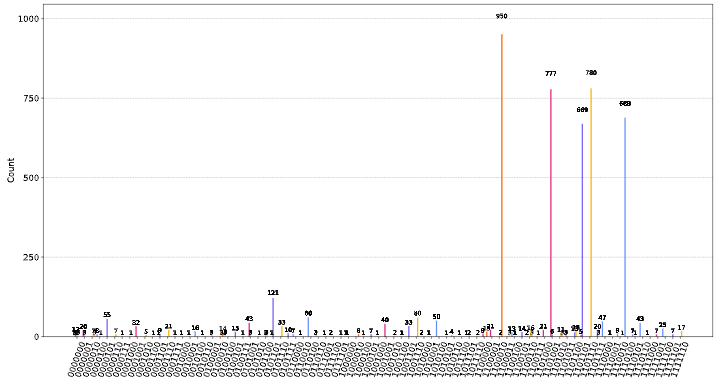
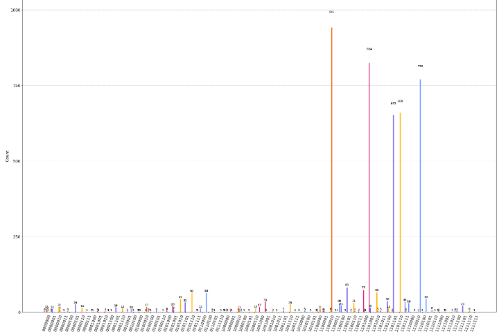
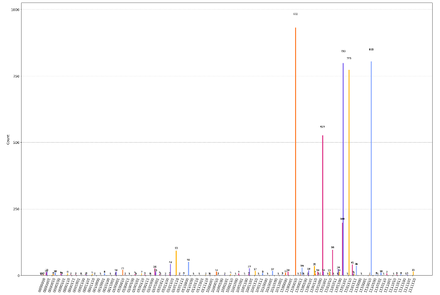

<!-- Title: -->
<div align="center">
  <h1> <a href="https://github.com/ShisheerKaushik24/Quantum_projects"> Quantum Secure Communication via Steganography </a></h1>
  <h2> A detailed description of the project
</div>
<br>
 
## Abstract
The idea is to encode the sender's text`(secret message)` using the concept of interference. The secret message is encoded based on the cover file`(a text sentence in this case)`. A Demo video of interactive working implementation is available here: [Demo](https://drive.google.com/file/d/1RHY_QOV1cPRRPEe5KYRz-5Mahdmc7Ia7/view?usp=sharing). 

More detailed explaination can be found [here](https://shisheerkaushik.netlify.app/) under the project menu. 

## Future Scopes and Improvements
The evaluation was done using three different communication protocols, namely *BB84*, *BB92*, and *Ekert91*, to evaluate the performance of the system. I compared the relative results obtained using each protocol to obtain more precise and accurate results. Additionally, I utilized a real quantum simulator named `FakeWashingtonV2()` to simulate the behavior of a real quantum computer. This simulator was chosen because it is a widely used open-source quantum simulator that can accurately simulate the behavior of a real quantum computer. By using this simulator, I was able to test the system's performance under realistic conditions and compare it with the theoretical predictions obtained through simulations.
  
<table align="center">
  <caption>Comparison results of `qasm_simulation` and `FakeWashingtonV2()` for BB84 prtotcol</caption>
  <tr>
    <td></td>
    <td></td>
  </tr>
</table>

<table align="center">
  <caption>Comparison results of `qasm_simulation` and `FakeWashingtonV2()` for BB92 protocol</caption>
  <tr>
    <td></td>
    <td></td>
  </tr>
</table>

<table align="center">
  <caption>Comparison results of `qasm_simulation` and `FakeWashingtonV2()` for Ekert91 protocol</caption>
  <tr>
    <td></td>
    <td></td>
  </tr>
</table>

As it is seen from the below graphs, the simulation done on `FakeWashingtonV2()` quantum computer is comparatively different from the one done on simulation. It’s because Quantum computers are exceedingly difficult to engineer, build and program. As a result, they are crippled by errors in the form of noise, faults and loss of quantum coherence, which is crucial to their operation and yet falls apart before any nontrivial program has a chance to run to completion. 

**First import Fake-Provider tool, via qiskit library**. 

Import 'FakeWashingtonV2`:
```bash
from qiskit.providers.fake_provider import FakeWashingtonV2
```

# License

This work is licensed under a [MIT License](LICENSE) license.

<hr>

Created and maintained by [@Shisheer S Kaushik][1].

[1]: https://github.com/ShisheerKauhik24
