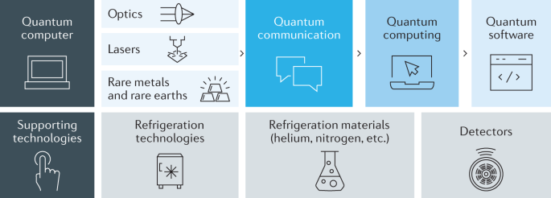

# Quantum Computing Projects

## Description:
This repository contains a collection of my projects related to quantum computing. These projects cover various aspects of quantum computing, such as quantum algorithms, quantum programming, quantum simulation, and quantum hardware.

## Contents: 
The repository contains the following projects: 

**Quantum Communication**: A Python implementation of the quantum teleportation algorithm using Qiskit. 
**Quantum Algorithm**: A Python implementation of the Grover's search algorithm using Qiskit. 
**Quantum Circuit Simulator**: A simple quantum circuit simulator built using Python and NumPy. 
**Quantum Error Correction**: An introduction to quantum error correction codes and their implementation using Qiskit. 
**Quantum Machine Learning**: An overview of quantum machine learning and its applications. 

Each project includes detailed documentation and instructions on how to run the code. The repository is constantly updated with new projects as I explore more topics in quantum computing.

## Packages Used

- `Qiskit`: A quantum computing software development framework used to build and execute quantum circuits. Used in the Quantum Teleportation and Grover's Algorithm implementations. To install, run `pip install qiskit`.

- `NumPy`: A Python package for scientific computing that provides support for large, multi-dimensional arrays and matrices, as well as a large library of mathematical functions. Used in the Quantum Circuit Simulator project. To install, run `pip install numpy`.

- `Pennylane`: An open-source software library for quantum machine learning, quantum computing, and optimization. Used in the Quantum Machine Learning project to demonstrate a quantum support vector machine. To install, run `pip install pennylane`.

## Getting Started:
To get started with these projects, simply clone or download the repository to your local machine. Each project has its own folder containing the necessary code and instructions on how to run it. Some projects may require installation of additional packages, such as Qiskit or Pennylane, which can be easily installed using pip.

## Contributions:
Contributions to the repository are always welcome! If you have any ideas for new projects or would like to contribute to an existing one, please feel free to open a pull request.
