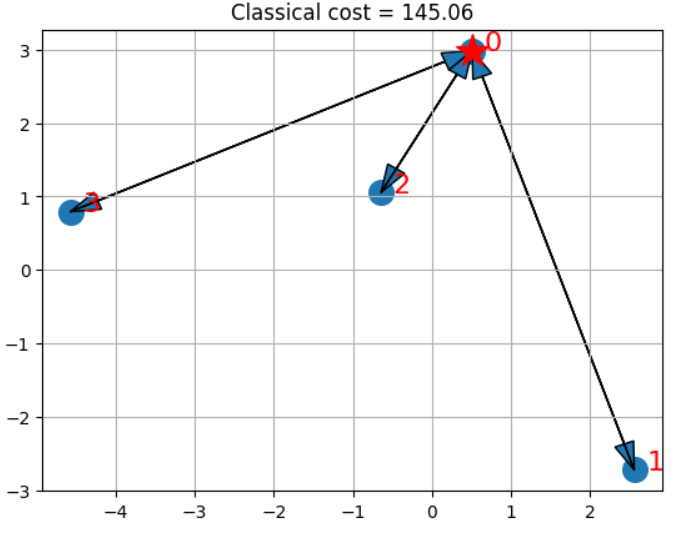
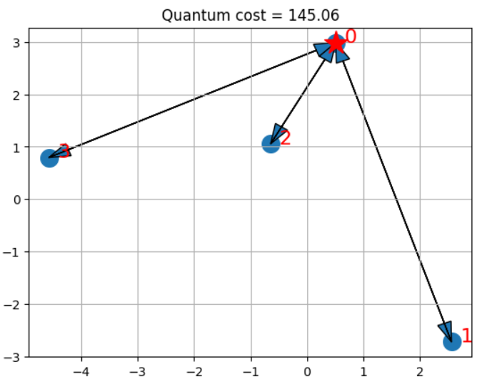
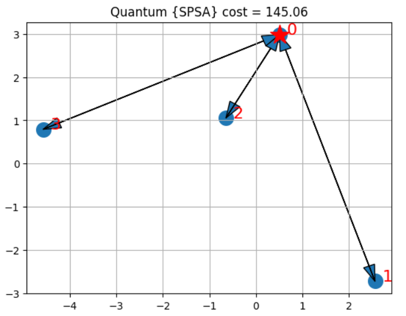
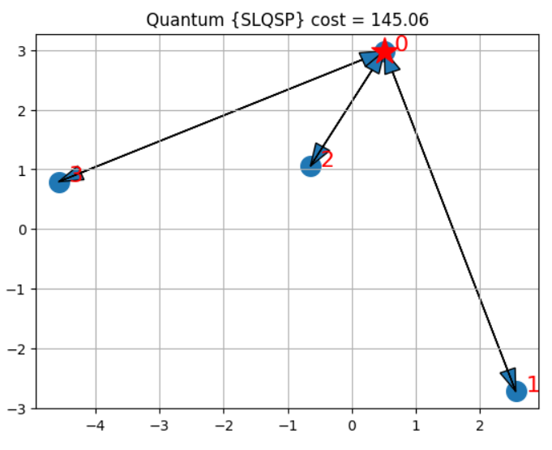
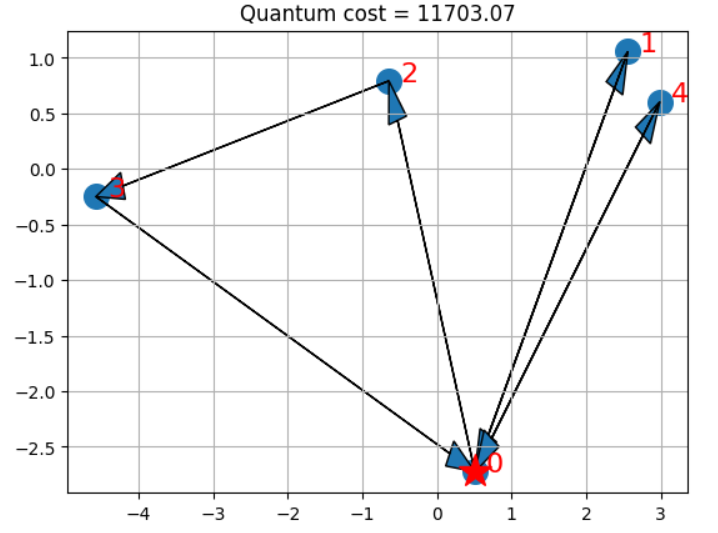

<!-- Title: -->

  <h1> <a href="https://en.wikipedia.org/wiki/Vehicle_routing_problem"> Vehicle Routing Problem </a></h1>
  <h2> <a href="https://qkrishi.com/"> @Qkrishi </a></h2>

 
The Vehicle routing problem (VRP) is an NP-hard optimization problem that has been an interest of research fordecades in science and industry. The gist of the project is to plan routes of vehicles to deliver goods to a fixed number of customers with optimal efficiency. Classical tools and methods provide good approximations to reach the optimal global solution. Quantum computing and quantum machine learning provide a new approach to solving combinatorial optimization of problems faster due to inherent speedups of quantum effects. Many solutions of VRP are offered across different quantum computing platforms using hybrid algorithms such as quantum approximate optimization algorithm and quadratic unconstrained binary optimization. In this work, we build a basic VRP solver for 3 and 4 cities using the variational quantum eigensolver on a fixed ansatz. The Project work is further extended to evaluate the robustness of the solution in several examples of noisy quantum channels. The performance of the quantum algorithm depends heavily on what noise model is used. In general, noise is detrimental, but not equally so among different noise sources. 
  

More detailed information about the project can be found [here:](https://shisheerkaushik.netlify.app/project/benchmarking-and-solving-vehicle-routing-problem-on-various-qpus/)

### Solving VRP using various Quantum optimization algorithms
Various Quantum optimzation algorithms like QAOA, VQE etc., is performed by using ibm-qiskit-sdk.

**The overall workflow we demonstrate comprises:** 
  1. Establish the client locations. Normally, these would be available ahead of the day of deliveries from a database. In our use case, we generate these randomly.
  2. compute the pair-wise distances, travel times, or similar. In our case, we consider the Euclidean distance, “as the crow flies”, which is perhaps the simplest possible.
  3. compute the actual routes. This step is run twice, actually. First, we obtain a reference value by a run of a classical solver *(IBM CPLEX)* on the classical computer. Second, we run an alternative, hybrid algorithm partly on the quantum computer.
  4. visualization of the results. In our case, this is again a simplistic plot.
  5. In the following, we first explain the model, before we proceed with the installation of the pre-requisites and the data loading.

**The project procedure can be summarized as follows:**
  1. Initialization *Install pip install `qiskit-optimization[cplex]`
  2. initializer class that randomly places the nodes in a 2-D plane and computes the distance between them.
  3. Classical solution using `IBM ILOG CPLEX`
  4. Instantiate the classical optimizer class
  5. Solve the problem in a classical fashion via `CPLEX`
  6. Visualize the solution
  7. Quantum solution from the ground up
  8. Instantiate the quantum optimizer class with parameters
  9. Check if the binary representation is correct
  10. Encode the problem as an instance of *QuadraticProgram*
  11. Solve the problem via `MinimumEigenOptimizer`
  12. Visualize the solution

**4 nodes + depot (1) &  3 vehicles**

<table align="center">
  <caption>Comparison results of `qasm_simulation` and `ibm_oslo`</caption>
  <tr>
    <td></td>
    <td></td>
  </tr>
</table>

**4 nodes + depot (1) &  3 vehicles, using `SPSA`, `L_BFGS_B` and `SLQSP`** 

<table align="center">
  <caption>Comparison results obtained when 3 discreet optimizers were utilized and simulated on `qasm_simulation` </caption>
  <tr>
    <td></td>
    <td></td>
    <td></td>
  </tr>
</table>

**5 nodes + depot (1) &  4 vehicles** 

<table align="center">
  <caption>Comparison results of `qasm_simulation` and `ibm_oslo`</caption>
  <tr>
    <td></td>
    <td></td>
  </tr>
</table>

  
The comparison plots between Cost's obtained from Classical and Quantum Algorithms present the  depot with a star and the selected routes for the vehicles with arrows. Note that in this particular case, we can find the optimal solution of the QP formulation, which happens to coincide with the optimal solution of the ILP.

Keep in mind that VQE is an heuristic working on the QP formulation of the Ising Hamiltonian, though. For suitable choices of A, local optima of the QP formulation will be feasible solutions to the ILP. While for some small instances, as above, we can find optimal solutions of the QP formulation which coincide with optima of the ILP, finding optimal solutions of the ILP is harder than finding local optima of the QP formulation, in general, which in turn is harder than finding feasible solutions of the ILP. Even within the VQE, one may provide stronger guarantees, for specific variational forms (trial wave functions).

### Solving VRP using Quantum Annealing technique
Similarly an attempt to to use Quantum Annealing technique is performed by using Dwave-ocean-sdk and the implementation data and its test results can be found [here:](https://github.com/ShisheerKaushik24/Junior-Researcher-Project-/tree/master/vehicle-routing/D-wave-annealer)

# Resources 
**Vehicle Routing Problem**
- [A Quantum Approximate Optimization Algorithm](https://arxiv.org/abs/1411.4028/)
- [Qiskit-Optimization](https://github.com/Qiskit/qiskit-optimization/blob/59d293d9d258eb3e8d780804252c1bdf5553e339/docs/tutorials/06_examples_max_cut_and_tsp.ipynb/)
- [Integer Programming Formulation of Traveling Salesman Problems](https://www.semanticscholar.org/paper/Integer-Programming-Formulation-of-Traveling-Miller-Tucker/f310643a22ec50a74a64f6203932b9407215d964/)
- [The Traveling Salesman Problem: A Computational Study](https://press.princeton.edu/books/hardcover/9780691129938/the-traveling-salesman-problem) 

**Quantum Annealing**
- [Thermally assisted quantum annealing of a 16-qubit problem](https://www.nature.com/articles/ncomms2920)
- [Quantum annealing with manufactured spins](https://www.researchgate.net/publication/51117464_Quantum_annealing_with_manufactured_spins)
- [Entanglement in a Quantum Annealing Processo](https://journals.aps.org/prx/pdf/10.1103/PhysRevX.4.021041)

# License

This work is licensed under a [Apache 2.0](LICENSE) license.

Created and maintained by [@Shisheer S Kaushik][1].

[1]: https://github.com/ShisheerKauhik24
