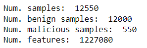
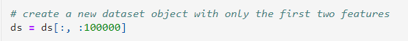
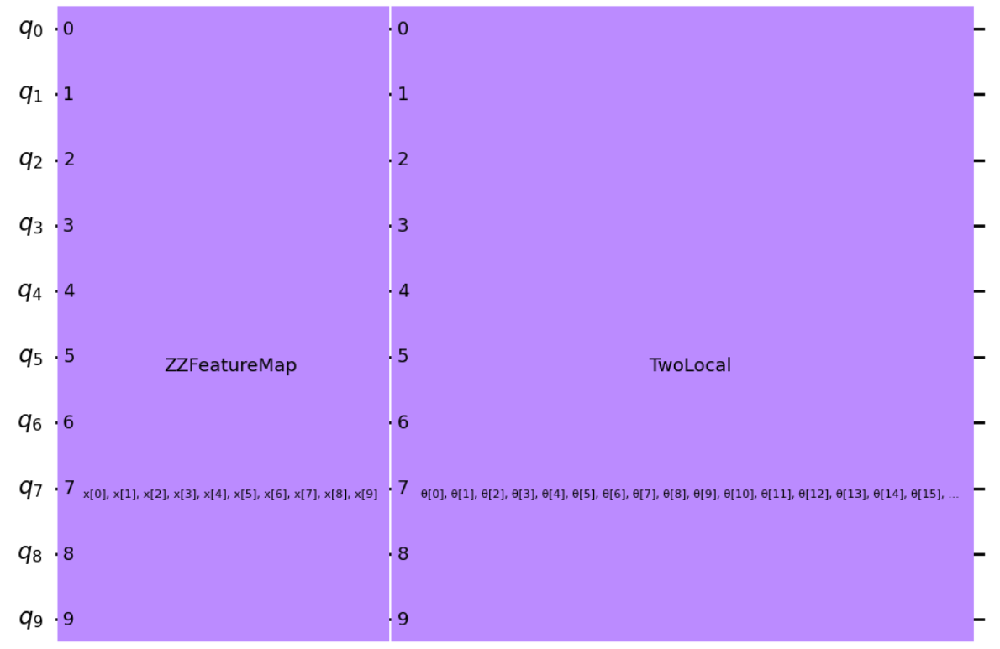
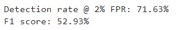
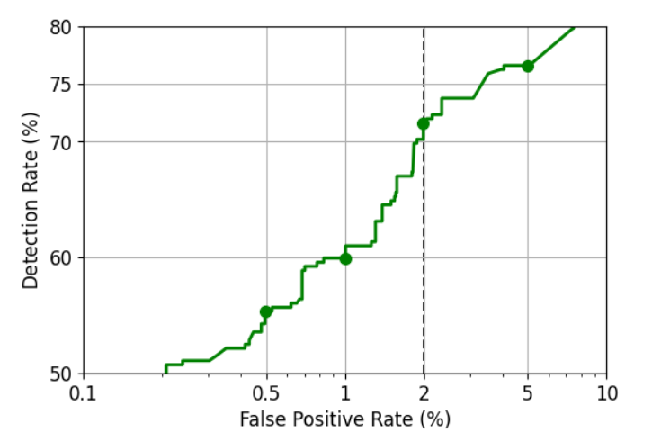
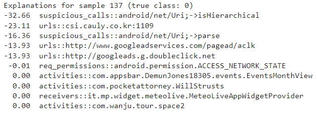
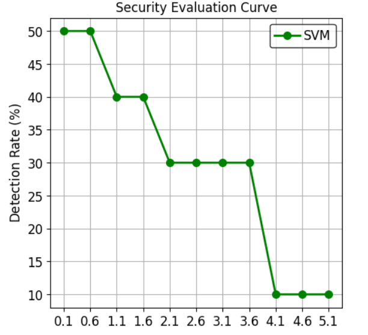

<!-- Badges: -->
[](https://github.com/ShisheerKaushik24/Quantum_projects/blob/master/android-malware-detection-using-vqc/LICENSE)
[](https://github.com/ShisheerKaushik24/Quantum_projects/graphs/commit-activity)

<!-- Title: -->
<div align="center">
  <h1> <a href="https://github.com/ShisheerKaushik24/Quantum_projects"> Android malware detection using QML </a></h1>
  <h2> All data related to the project
</div>
<br>
  
<!-- Author: -->
<div align="center">
  <b>Developer: <a target="_blank" href="https://github.com/ShisheerKaushik24">¹Shisheer S Kaushik</a></b>
<br>
</div>

## Description:
**Machine Learning (ML)** systems are nowadays being extensively used as the core components of many systems, including malware detectors. Despite the impressive performances reported by such systems on benchmark datasets, the problem of detection in the wild is still far from being solved. In fact, many of these algorithms were not designed to cope with Adversarial Examples.

The gist of project is to build, explain, attack, and evaluate the security of a malware detector for Android applications. The code uses `SecML`, a Python library for Secure and Explainable Machine Learning, which provides a set of tools for implementing, training, and evaluating secure machine learning models.

The code starts by checking if SecML is already installed, and if not, installs it using pip. Then, it loads a toy dataset of Android applications named DrebinRed, consisting of **12,000 benign** and **550 malicious** samples extracted from the `Drebin` dataset. The Drebin dataset was introduced in the paper *"Drebin: Effective and Explainable Detection of Android Malware in Your Pocket" by Arp et al. (2014)*, and the DrebinRed dataset is a reduced version of it. The dataset is downloaded from a GitLab repository using the `dl_file_gitlab()` function from the `secml.utils.download_utils module`.

The dataset is loaded using the `pickle_utils.load()` function from the secml.utils.pickle_utils module, and its properties are printed to the console, including the number of samples, the number of benign and malicious samples, and the number of features. Finally, the code shows that the dataset consists of **1227080** features, which is a large number of features and can pose a challenge for machine learning models due to the curse of dimensionality.



The code trains and tests a detector for recognizing **benign** and **malicious** applications. The following packages and modules are used:



-`re`: provides regular expression matching operations</br>
-`secml`: a machine learning library for Python</br>
-`secml.utils`: provides utility functions</br>
-`secml.utils.download_utils`: provides functions to download files from GitLab</br>
-`secml.utils.pickle_utils`: provides functions to pickle and unpickle objects</br>
-`qiskit.circuit.library`: provides pre-built quantum circuits and circuit libraries</br>
-`qiskit.algorithms.optimizers`: provides classical optimization algorithms for quantum circuits</br>
-`qiskit_machine_learning.algorithms`: provides quantum machine learning algorithms</br>
-`qiskit_machine_learning.neural_networks`: provides quantum neural network models</br>
-`qiskit_machine_learning.algorithms.classifiers`: provides quantum classifiers</br>
-`qiskit.utils`: provides utility functions for Qiskit</br>
-`secml.ml.features`: provides feature normalization functions</br>
-`secml.ml.classifiers`: provides machine learning classifiers</br>
-`secml.data.splitter`: provides functions to split datasets into training and test sets</br>
-`secml.ml.peval.metrics`: provides performance evaluation metrics for machine learning models</br>

The code performs the following steps:

1. Import the required packages and modules and sets a seed value for `reproducibil`.

2. Load the dataset and select the first two features.

3. Split the dataset into training and test sets.

4. Define the quantum feature map.

5. Define the quantum circuit for the kernel.



6. Define the quantum instance to run the circuit on a simulator.

7. Define the classical optimizer.

8. Define the VQC instance with SVM classifier and `COBYLA` optimizer.

9. Train the VQC classifier on the training set.

10. Evaluate the performance of the VQC classifier on the test set.



11. Report the performance of the VQC classifier by means of the Detection Rate @ 2% False Positive Rate, the F1 score and by plotting the Receiver Operating Characteristic (ROC) curve.

</br>

11. Explanation by considering sample **137** for the obstained result.



12. Print the total time taken for training the classifier.


Finally, the code plots the Security Evaluation Curve, which shows the detection rate of the detector as a function of the perturbation distance dmax. The curve shows that the detector is vulnerable to adversarial attacks, as changing less than 10 features can cause more than 50% of the malicious samples to be misclassified as *benign* applications.

The computation time of the security evaluation is also reported at the end of the code.



It is observed that this malware detector based on the VQC classifier is vulnerable to adversarial attacks and after changing less than *10* features half of the malicious samples are incorrectly classified as benign applications. This known vulnerability has also been highlighted when we listed the top influential features and observed that most of the relevance is given to a very limited set of features.

At first, load a toy dataset of Android applications, named `DrebinRed`, consisting of *12,000 benign and 550 malicious* samples extracted from the **Drebin** dataset::
```bash
%%capture --no-stderr --no-display
# NBVAL_IGNORE_OUTPUT

try:
  import secml
except ImportError:
  %pip install git+https://github.com/pralab/secml
```
Also, install Qiskit Machine Learning dependencies (see [Docs](https://qiskit.org/documentation/machine-learning/getting_started.html)):
```bash
python3 -m pip install -U qiskit[machine-learning]
```
Alternatively, one can install the required dependencies via the [requirement.txt](requirement.txt) file:
```bash
python3 -m pip install --user --upgrade pip && python3 -m pip install -r requirements.txt
```

# License

This work is licensed under a [MIT License](https://github.com/ShisheerKaushik24/Quantum_projects/blob/master/android-malware-detection-using-vqc/LICENSE) license.

<hr>

Created and maintained by [@Shisheer S Kaushik][1].

[1]: https://github.com/ShisheerKauhik24
