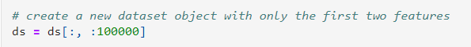
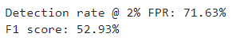
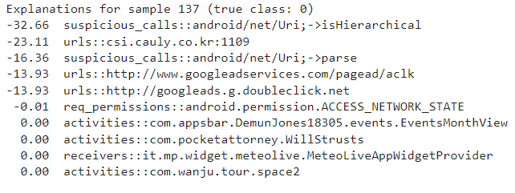

**Machine Learning (ML)** systems are nowadays being extensively used as the core components of many systems, including malware detectors. Despite the impressive performances reported by such systems on benchmark datasets, the problem of detection in the wild is still far from being solved. In fact, many of these algorithms were not designed to cope with Adversarial Examples.

The gist of project is to build, explain, attack, and evaluate the security of a malware detector for Android applications. The code uses `SecML`, a Python library for Secure and Explainable Machine Learning, which provides a set of tools for implementing, training, and evaluating secure machine learning models.

The code starts by checking if SecML is already installed, and if not, installs it using pip. Then, it loads a toy dataset of Android applications named DrebinRed, consisting of **12,000 benign** and **550 malicious** samples extracted from the `Drebin` dataset. The Drebin dataset was introduced in the paper *"Drebin: Effective and Explainable Detection of Android Malware in Your Pocket" by Arp et al. (2014)*, and the DrebinRed dataset is a reduced version of it. The dataset is downloaded from a GitLab repository using the `dl_file_gitlab()` function from the `secml.utils.download_utils module`.

The dataset is loaded using the `pickle_utils.load()` function from the secml.utils.pickle_utils module, and its properties are printed to the console, including the number of samples, the number of benign and malicious samples, and the number of features. Finally, the code shows that the dataset consists of **1227080** features, which is a large number of features and can pose a challenge for machine learning models due to the curse of dimensionality.

The code trains and tests a detector for recognizing **benign** and **malicious** applications. The following packages and modules are used:

-`re`: provides regular expression matching operations
-`secml`: a machine learning library for Python
-`secml.utils`: provides utility functions
-`secml.utils.download_utils`: provides functions to download files from GitLab
-`secml.utils.pickle_utils`: provides functions to pickle and unpickle objects
-`qiskit.circuit.library`: provides pre-built quantum circuits and circuit libraries
-`qiskit.algorithms.optimizers`: provides classical optimization algorithms for quantum circuits
-`qiskit_machine_learning.algorithms`: provides quantum machine learning algorithms
-`qiskit_machine_learning.neural_networks`: provides quantum neural network models
-`qiskit_machine_learning.algorithms.classifiers`: provides quantum classifiers
-`qiskit.utils`: provides utility functions for Qiskit
-`secml.ml.features`: provides feature normalization functions
-`secml.ml.classifiers`: provides machine learning classifiers
-`secml.data.splitter`: provides functions to split datasets into training and test sets
-`secml.ml.peval.metrics`: provides performance evaluation metrics for machine learning models

The code performs the following steps:

1. Import the required packages and modules and sets a seed value for reproducibil.

2. Load the dataset and select the first two features.

3. Split the dataset into training and test sets.

4. Define the quantum feature map.

5. Define the quantum circuit for the kernel.

6. Define the quantum instance to run the circuit on a simulator.

7. Define the classical optimizer.

8. Define the VQC instance with SVM classifier and COBYLA optimizer.

9. Train the VQC classifier on the training set.

10. Evaluate the performance of the VQC classifier on the test set.

11. Report the performance of the VQC classifier by means of the Detection Rate @ 2% False Positive Rate, the F1 score and by plotting the Receiver Operating Characteristic (ROC) curve.

12. Print the total time taken for training the classifier.

The code imports two metrics from the secml.ml.peval.metrics module, namely `CMetricTHatFPR` and `CMetricTPRatTH`.

The code then uses CMetricTHatFPR to compute the threshold at which the Detection Rate should be computed. The performance score is computed using the `y_true` and `score_pred` parameters. The y_true parameter represents the true labels of the test set and the `score_pred[:, 1].ravel()` parameter represents the predicted probability scores of the positive class (malicious) for the test set. The value of `fpr_th` is not shown in this code snippet but should be a predefined value of false positive rate (FPR) at which we want to compute the Detection Rate.

The `fpr` and `tpr` variables are obtained by computing the Receiver Operating Characteristic (ROC) curve using the `CRoc().compute()` method from the `secml.ml.peval.metrics` package. This method takes as input the true labels `(ts.Y)` and the predicted scores `(score_pred[:, 1].ravel())` of the test set.

The `CFigure` class from the `secml.figure` package is used to create a figure for visualizing the ROC curve. The `plot_roc()` method of the `CFigure.sp` (subplot) attribute is used to plot the ROC curve using the `fpr` and `tpr` variables as input. The `axvline()` method is used to draw a vertical line at `x=2` with a black color and a dashed line style. The `xlim()` and `ylim()` methods are used to set the limits of the x and y axes, respectively. The `yticks()` and `yticklabels()` methods are used to customize the tick labels of the y axis. Finally, the `ylabel()` method is used to set the label of the y axis to "Detection Rate $(%)$". The `%matplotlib` inline line is used to display the figure in the notebook.

The code then uses a convenience function from fig.sp to plot the Security Evaluation Curve. The function takes in `sec_eval.sec_eval_data` as the first parameter, which represents the Security Evaluation Curve data. The metric parameter is set to `CMetricTPRatTH(th=th)`, which means that the True Positive Rate (TPR) at the threshold value th (computed using `CMetricTHatFPR`) is used as the performance metric. The percentage parameter is set to True, which means that the performance metric is expressed as a percentage. The label parameter is set to 'SVM', which represents the name of the classifier. The color parameter is set to 'green', which represents the color of the plot line. The marker parameter is set to 'o', which represents the marker shape used in the plot.

Finally, the code prints the computation time in seconds using the `start_time` and `end_time` variables. The computation time represents the time taken to run the code from start to end.
This section of the tutorial explains how the decisions of the trained Android malware detector are computed by analyzing the trained model. The Gradient Input gradient-based explanation method, which is implemented by the `CExplainerGradientInput` class, is used to compute the post-hoc explanations for each sample. For each sample, one benign and one malicious, we compute the explanations with respect to the positive (malicious) class and list the top-10 influential features, along with the corresponding relevance (%). We observe that more than **~50%** of the relevance is assigned to only 10 features in both cases, highlighting a known behavior of these classifiers, which tend to assign most of the weight to a small set of features, making them vulnerable to adversarial evasion attacks.

The next section of the tutorial explains how a gradient-based maximum-confidence evasion attack is set up to create adversarial examples against the SVM classifier on which the *Android malware* detector is based on. The solver parameters are chosen, and `lb` and `ub` constraints are set up. The `lb` and `ub` constraints are critical in this application as adding and removing features from the original applications are both theoretically possible, but feature removal is a non-trivial operation that can easily compromise the malicious functionalities of the application, and only be performed for not-manifest components. On the other hand, feature addition is a safer operation, especially when the injected features belong to the manifest. Therefore, to only allow feature addition, `lb` is set to *'x0'* and ~ub` is set to **1**. The `CAttackEvasionPGDLS` class is used to perform the attack.

In this section, the code is used to compute the post-hoc explanations for the trained Android malware detector. The goal is to understand which components of the applications are more relevant during the decision (classification) phase.

The Gradient Input explanation method is used, which is implemented by the CExplainerGradientInput class. This method is gradient-based and optimized to run on sparse data, making it suitable for this application example.

For each sample, one benign and one malicious, the code computes the explanations with respect to the positive (malicious) class and lists the top-10 influential features, along with the corresponding relevance (%).

The code first creates an instance of the `CExplainerGradientInput` class, passing the trained classifier `(clf)` as an argument. It then prints a message indicating the name of the explanation method that will be used.

Next, the code selects a sample `(i=137)` from the test set, and prints a message indicating the true class of the sample *(benign or malicious)*.

Then, the code computes the explanations for the sample using the explain method of the expl object, passing the input features (x) and the true class (y=1, which corresponds to the positive/malicious class). The resulting explanations are stored in the attr variable.

Finally, the code normalizes the explanations to be in the range 0-100, sorts them by absolute value in descending order, and stores the indices of the sorted explanations in the `attr_argsort` variable. The top-10 influential features are then obtained from `attr_argsort`, and their indices and relevance values are printed.

The code in this section performs a security evaluation of the trained Android malware detector by analyzing its vulnerability to adversarial attacks. Specifically, it generates a set of adversarial samples by perturbing a set of malicious samples, and then evaluates the performance of the detector on these adversarial samples.

The first part of the code sets up the security evaluation parameters, including the maximum distance dmax that the adversarial perturbation can introduce, and generates a set of adversarial samples by selecting a subset of malicious samples from the test set.

Next, the `CSecEval` class is used to perform the security evaluation. This class takes the attack object evasion, which implements the adversarial attack, and a range of values for the parameter `dmax`. The `run_sec_eval` method is then called to generate the adversarial samples for each value of `dmax` and evaluate the performance of the detector on these samples.

Finally, the code plots the Security Evaluation Curve, which shows the detection rate of the detector as a function of the perturbation distance dmax. The curve shows that the detector is vulnerable to adversarial attacks, as changing less than 10 features can cause more than 50% of the malicious samples to be misclassified as *benign* applications.

The computation time of the security evaluation is also reported at the end of the code.

It is observed that this malware detector based on the VQC classifier is vulnerable to adversarial attacks and after changing less than *10* features half of the malicious samples are incorrectly classified as benign applications. This known vulnerability has also been highlighted when we listed the top influential features and observed that most of the relevance is given to a very limited set of features.

**Why does it take a long tiem to test and train more datasets using VQC method**

The Variational Quantum Classifier (VQC) is a quantum machine learning algorithm that combines quantum circuits with classical machine learning. Training and testing a VQC model can take a long time because it involves performing multiple iterations of quantum circuit evaluations and parameter updates.

Quantum computers are still in the early stages of development, and currently available quantum hardware has a limited number of qubits and low coherence times, which makes it difficult to perform complex computations efficiently. Therefore, running VQC on current quantum hardware may require running the algorithm multiple times, which can increase the computation time significantly.

Furthermore, VQC requires significant expertise in both quantum computing and machine learning to develop and implement properly. This can limit the number of experts available to work on such projects, further contributing to longer computation times. Additionally, *optimizing* *hyperparameters*, selecting the appropriate optimizer and learning rate, and tuning the number of *epochs* for training can also contribute to the longer computation time.

Finally, as the dataset size increases, the computation time for training and testing the VQC model increases as well. This is because more data points need to be processed, and the complexity of the problem grows exponentially with the number of data points.
